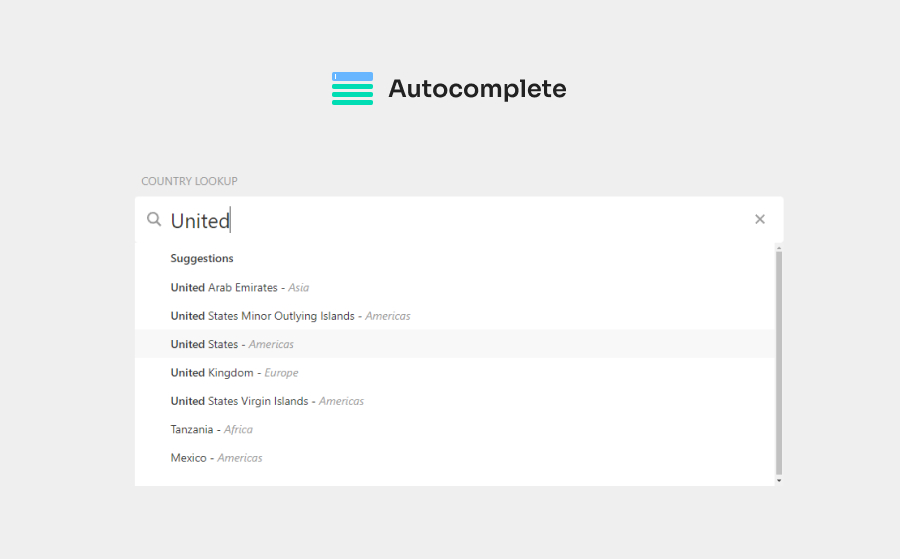

[](https://hellraiserrob.github.io/autocomplete)

# Autocomplete
A flexible and customisable autocomplete/typeahead library for you to use in your projects or use as a learning resource.

[**Launch demo**](https://hellraiserrob.github.io/autocomplete/)

----

### Features

- Lightweight & Responsive
- Typescript
- Works with any api response
- Provide your own callbacks to work with your application functionality

### Documentation
Options and usage notes

#### Options

|             | Description | Type    | 
| ----------- | ----------- | ------- | 
| el    | The autocomplete DOM element  | HTMLElement |
| url    | The endpoint to call to get the results, `{value}` token is replaced with search string  | String |
| titleKey    | Gets the item title value from your results object, uses [lodash get](https://lodash.com/docs/4.17.15#get) to reach deep into the object if required | String |
| textKey    | Gets the primary item text value from your results object, uses [lodash get](https://lodash.com/docs/4.17.15#get) to reach deep into the object if required | String |
| handleResponse    | Your function to return the autocomplete results array from the api response  | Function |
| onSelect    | Your function to perform a custom action when an autocomplete item is selected, gets passed the entire item object as an argument  | Function |

#### Example usage

```typescript
import Autocomplete from "./autocomplete";

const autocomplete = document.querySelectorAll<HTMLElement>(`.autocomplete`);

autocomplete.forEach(el => {
  const options = {
    el,
    // https://restcountries.com/
    // the url of your endpoint
    url: "https://restcountries.com/v3.1/name/{value}",
    // how to handle the api response to return the results array
    handleResponse: (response) => {
      return response;
    },
    // handle item selection however you want
    onSelect: (data) => {
      console.log(data);
    },
    // https://lodash.com/docs/4.17.15#get
    // Gets the dropdown values at path of your item object
    titleKey: "name.common",
    textKey: "region"
  };
  const ac = new Autocomplete(options)

  ac.bind();
})

```